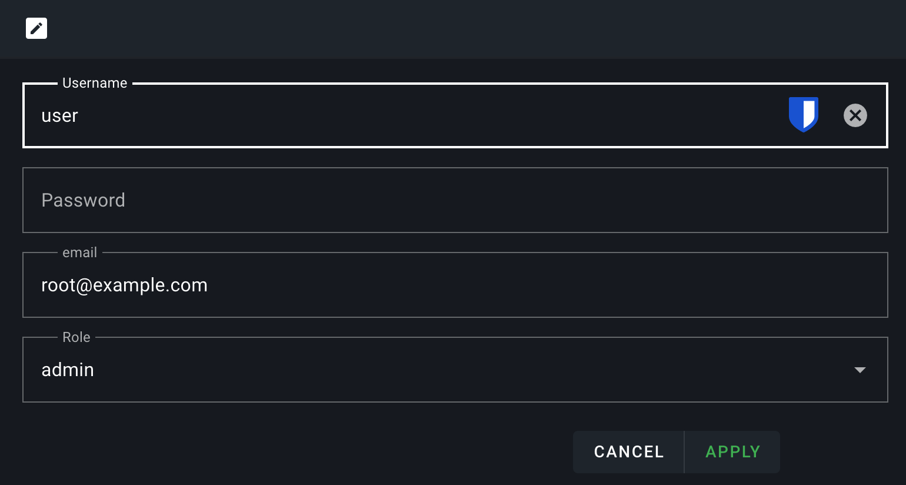

# OIDC Setup With Pocket ID

## A quick rundown of the technologies

### What is Pocket ID?

Pocket ID is a simple OIDC provider that allows users to authenticate with their passkeys to your services.

The goal of Pocket ID is to be a simple and easy-to-use. There are other self-hosted OIDC providers like Keycloak or ORY Hydra but they are often too complex for simple use cases.

Additionally, what makes Pocket ID special is that it only supports passkey authentication, which means you don’t need a password.

### What is OAuth2?

OAuth2 (Open Authorization 2.0) is an industry-standard protocol for authorization. It allows applications (clients) to gain limited access to user accounts on an HTTP service without sharing the user’s credentials. Instead, it uses access tokens to facilitate secure interactions. OAuth2 is commonly used in scenarios where users need to authenticate via a third-party service.

### What is OpenID Connect (OIDC)?

OIDC (OpenID Connect) is an identity layer built on top of OAuth2. While OAuth2 primarily handles authorization, OIDC adds authentication, enabling applications to verify a user’s identity and obtain profile information. This makes OIDC suitable for SSO solutions, where user identity is central to access management.

## Setting up a client in Pocket ID

### Step 1: Install and Configure Pocket ID

Before setting up the OIDC client, ensure that Pocket ID is installed and running by following the [setup guide](https://github.com/stonith404/pocket-id#setup).

### Step 2: Add a client

Once you have logged in and configured a PassKey you now need to create an OIDC client, this will let Pocket ID know about the application that needs to be configured, and will give you the relevant keys to add to the RomM compose file.

- Make sure within Application Configuration that "Emails Verified" is ticked, most OIDC apps will need this.
- Go to OIDC Client
- Click Add OIDC Client
    - Name: RomM
    - Callback URLs: `https://{host}/api/oauth/openid`
- Click Save
- Stay on this page, you will be shown your client secret only THIS time.

### Step 3: Configure RomM Environment Variables

To enable OIDC authentication in RomM, you need to set the following environment variables:

- `OIDC_ENABLED`: Set to `true` to enable OIDC authentication.
- `OIDC_PROVIDER`: The lowercase name of the provider (`pocketid`).
- `OIDC_CLIENT_ID`: The client ID copied from the Pocket ID application
- `OIDC_CLIENT_SECRET`: The client secret that is showing within your Pocket ID application.
- `OIDC_REDIRECT_URI`: The redirect URI configured in the Pocket ID provider, in the format `https://{host}/api/oauth/openid`.
- `OIDC_SERVER_APPLICATION_URL`: The authorization URL for you Pocket ID instance, e.g. `https://id.host.local/authorize`.

### Step 4: Set your Email in RomM

In RomM, open your user profile and set your email address. This email **has to match** your user email in Pocket ID.

### Step 5: Test the Integration

After configuring the environment variables, restart (or stop and remove) your RomM instance and navigate to the login page. You should see an option to log in using OIDC. Click on the OIDC button, and you'll be redirected to Pocket ID for authentication. Once authenticated, you'll be redirected back to RomM.

